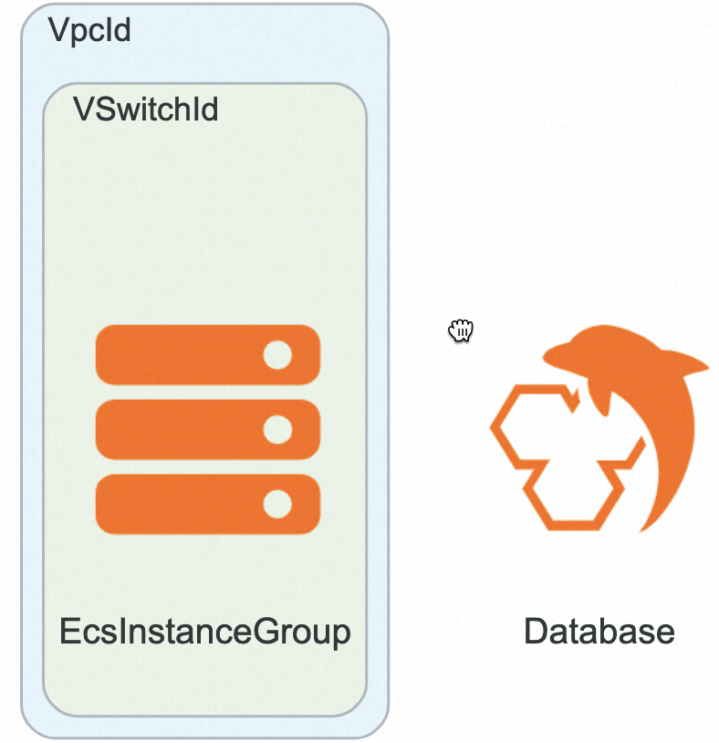

# MLflow社区版计算巢快速部署


>**免责声明：**本服务由第三方提供，我们尽力确保其安全性、准确性和可靠性，但无法保证其完全免于故障、中断、错误或攻击。因此，本公司在此声明：对于本服务的内容、准确性、完整性、可靠性、适用性以及及时性不作任何陈述、保证或承诺，不对您使用本服务所产生的任何直接或间接的损失或损害承担任何责任；对于您通过本服务访问的第三方网站、应用程序、产品和服务，不对其内容、准确性、完整性、可靠性、适用性以及及时性承担任何责任，您应自行承担使用后果产生的风险和责任；对于因您使用本服务而产生的任何损失、损害，包括但不限于直接损失、间接损失、利润损失、商誉损失、数据损失或其他经济损失，不承担任何责任，即使本公司事先已被告知可能存在此类损失或损害的可能性；我们保留不时修改本声明的权利，因此请您在使用本服务前定期检查本声明。如果您对本声明或本服务存在任何问题或疑问，请联系我们。

## 概述

MLflow是一个开源的机器学习生命周期管理平台，旨在简化机器学习项目的开发、训练、部署和管理过程。它提供了一套工具和接口，帮助用户跟踪实验结果、管理模型版本、记录和分享代码、数据和模型参数等。MLflow的核心组件包括：
1. 实验（Experiments）：用于记录和跟踪不同参数、指标和代码版本的机器学习实验，方便用户对实验结果进行比较和分析。
2. 跟踪（Tracking）：用于记录和追踪模型训练过程中的指标、参数和输出结果，帮助用户追溯模型开发历史。
3. 模型注册（Model Registry）：用于管理训练好的模型版本，并提供模型版本的跟踪、审批和共享功能。
4. 部署（Deployment）：提供了一些部署模型的选项，包括本地部署、云端托管和容器化部署等。
5. 项目（Projects）：用于组织和管理机器学习项目，帮助用户管理项目代码、数据和环境依赖。

MLflow不仅支持主流的机器学习库（如TensorFlow、PyTorch和scikit-learn等），还可以与任何库、算法或部署工具进行集成。此外，MLflow还具有可扩展性，用户可以编写插件来扩展其功能，以满足不同项目和环境的需求。总之，MLflow是一个灵活、可扩展的平台，帮助用户管理和跟踪机器学习项目的整个生命周期。

## 前提条件

部署AlphaFold2社区版服务实例，需要对部分阿里云资源进行访问和创建操作。因此您的账号需要包含如下资源的权限。
  **说明**：当您的账号是RAM账号时，才需要添加此权限

  | 权限策略名称                          | 备注                     |
  |---------------------------------|------------------------|
  | AliyunECSFullAccess             | 管理云服务器服务（ECS）的权限       |
  | AliyunRDSFullAccess             | 管理瑶池数据库（RDS）的权限     |
  | AliyunVPCFullAccess             | 管理专有网络（VPC）的权限         |
  | AliyunROSFullAccess             | 管理资源编排服务（ROS）的权限       |
  | AliyunComputeNestUserFullAccess | 管理计算巢服务（ComputeNest）的用户侧权限 |


## 计费说明

MLflow社区版在计算巢部署的费用主要涉及：

- 云服务器（ECS）费用
- 瑶池数据库（RDS）费用
- 流量带宽费用

## 部署架构


- 部署由一台ECS服务器，用来启动MLflow服务，另需要一个PG数据库当做存储模型库

## 参数说明
| 参数组         | 参数项      | 说明                                                                     |
|-------------|----------|------------------------------------------------------------------------|
| 服务实例        | 服务实例名称   | 长度不超过64个字符，必须以英文字母开头，可包含数字、英文字母、短划线（-）和下划线（_）                          |
|             | 地域       | 服务实例部署的地域                                                              |
|             | 付费类型     | 资源的计费类型：按两付费和包年包月                                                      |
| ECS实例配置    | 集群登录密码   | 长度8-30，必须包含三项（大写字母、小写字母、数字、 ()`~!@#$%^&*-+=&#124;{}[]:;'<>,.?/ 中的特殊符号） |
|             |   实例类型 | 可用区下可以使用的实例规格                                                      |  
| 数据库实例配置 | 登录密码   | 长度8-30，必须包含三项（大写字母、小写字母、数字、 ()`~!@#$%^&*-+=&#124;{}[]:;'<>,.?/ 中的特殊符号） |
|             |   实例类型 | 可用区下可以使用的实例规格                                                      |  
| MLflow配置  | 端口号   |   默认5000                                                                           |
|              | 共享目录  | 本地磁盘路径
| 网络配置        | 可用区      | ECS实例所在可用区                                                             |
|             | VPC ID   | 资源所在VPC                                                                |
|             | 交换机ID    | 资源所在交换机                                                                |

## 部署流程
1. 访问计算巢MLflow社区版[部署链接](https://computenest.console.aliyun.com/user/cn-hangzhou/serviceInstanceCreate?ServiceId=service-ba5e800a0e124c23935b)
，按提示填写部署参数：
    
    

3. 参数填写完成后可以看到对应询价明细，确认参数后点击**下一步：确认订单**。
   

4. 确认订单完成后同意服务协议并点击**立即创建**
   进入部署阶段。
    

5. 部署完成后，可以通过查看MLflow服务访问URL，访问ui页面或者在模型中集成服务地址
 ## 使用MLflow管理模型和实验
例如，如果您在 IP 地址**192.168.0.1**和端口**5000**的计算机上运行上述命令，则可以通过以下方式向其添加跟踪数据：

```python
mlflow.set_tracking_uri("http://192.168.0.1:5000")
mlflow.autolog()  # Or other tracking functions
```

或者，在您的开发计算机上，您可以将MLFLOW_TRACKING_URI环境变量设置为该服务器的 URL：
```shell
export MLFLOW_TRACKING_URI=http://192.168.0.1:5000 
```
现在，当您运行代码时，它会将跟踪数据发送到跟踪服务器。您可以通过使用浏览器导航到 URI 来查看跟踪数据。
跟踪后端有许多可用选项。有关更多详细信息，请参阅[MLflow 跟踪服务器](https://mlflow.org/docs/latest/tracking.html#tracking-server)。
